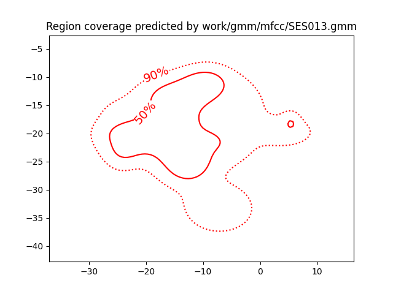
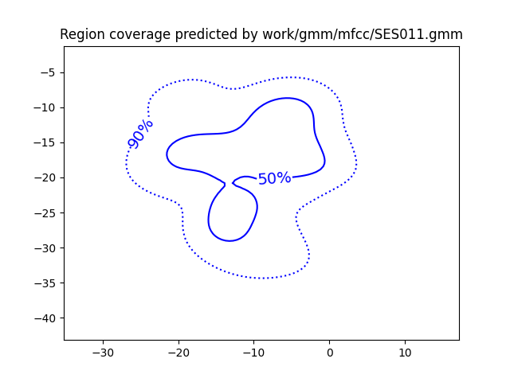
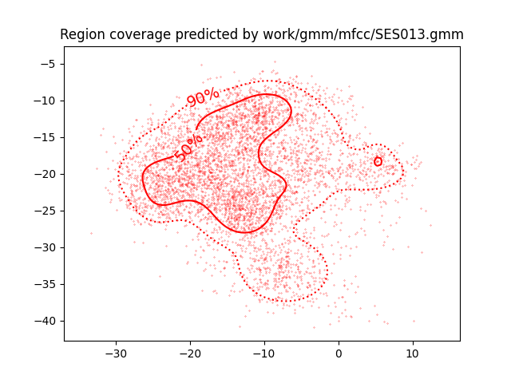
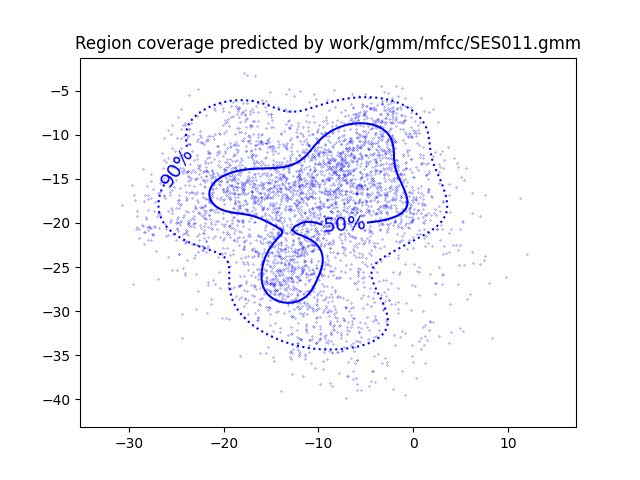
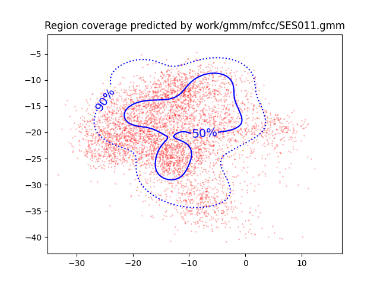
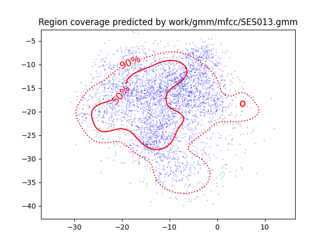

PAV - P4: reconocimiento y verificación del locutor
===================================================

Obtenga su copia del repositorio de la práctica accediendo a [Práctica 4](https://github.com/albino-pav/P4)
y pulsando sobre el botón `Fork` situado en la esquina superior derecha. A continuación, siga las
instrucciones de la [Práctica 2](https://github.com/albino-pav/P2) para crear una rama con el apellido de
los integrantes del grupo de prácticas, dar de alta al resto de integrantes como colaboradores del proyecto
y crear la copias locales del repositorio.

También debe descomprimir, en el directorio `PAV/P4`, el fichero [db_8mu.tgz](https://atenea.upc.edu/pluginfile.php/3145524/mod_assign/introattachment/0/spk_8mu.tgz?forcedownload=1)
con la base de datos oral que se utilizará en la parte experimental de la práctica.

Como entrega deberá realizar un *pull request* con el contenido de su copia del repositorio. Recuerde
que los ficheros entregados deberán estar en condiciones de ser ejecutados con sólo ejecutar:

~~~~~~~~~~~~~~~~~~~~~~~~~~~~~~~~~~~~~~~~~~~~~~~~~~~~~.sh
  make release
  run_spkid mfcc train test classerr verify verifyerr
~~~~~~~~~~~~~~~~~~~~~~~~~~~~~~~~~~~~~~~~~~~~~~~~~~~~~

Recuerde que, además de los trabajos indicados en esta parte básica, también deberá realizar un proyecto
de ampliación, del cual deberá subir una memoria explicativa a Atenea y los ficheros correspondientes al
repositorio de la práctica.

A modo de memoria de la parte básica, complete, en este mismo documento y usando el formato *markdown*, los
ejercicios indicados.

## Ejercicios.

### SPTK, Sox y los scripts de extracción de características.

- Analice el script `wav2lp.sh` y explique la misión de los distintos comandos involucrados en el *pipeline*
  principal (`sox`, `$X2X`, `$FRAME`, `$WINDOW` y `$LPC`). Explique el significado de cada una de las 
  opciones empleadas y de sus valores.

  El pipeline principal se encuentra en la línia 42 del script:

  `sox $inputfile -t raw -e signed -b 16 - | $X2X +sf | $FRAME -l 240 -p 80 | $WINDOW -l 240 -L 240 | $LPC -l 240 -m $lpc_order > $base.lp`

  - `sox`: Lee y manipula archivos de audio. Permite convertir un fichero de entrada de audio (WAVE, en nuestro caso) a otro tipo de formato manipulable por los otros programas del pipeline. La opción `-t raw` significa que el fichero de entrada es "raw", o sin cabecera. Seguidamente, `-e signed` indica que codificará en `signed-integer` y `-b 16` que esa codificación será de 16 bits.

  - `$X2X`: Subprograma de SPTK que permite transformar distintos tipos de datos. La opción `+sf` convierte de "short" 16 bits a "float" 32 bits.

  - `$FRAME`: Subprograma de SPTK que permite dividir los datos de entrada en frames, con la opción de introducir solapamiento. Opciones: `-l 240 -p 80` indica trama de longitud 240 y desplazadas 80 muestras.

  - `$WINDOW`: Subprograma de SPTK que permite multiplicar el fichero de entrada por una función de enventanado. Opciones: `-l 240 -L 240` indica longitud de entrada 240 muestras y longitud de salida 240 muestras. No se indica tipo de ventana por la que usará la por defecto, que es Blackman.

  - `$LPC`: Subprograma de SPTK que calcula los coeficientes LPC a partir de tramas de datos enventanados. Opciones: `-l 240 -m $lpcorder` indica tamaño de trama 240 muestras y orden de LPC "$lpcorder".

- Explique el procedimiento seguido para obtener un fichero de formato *fmatrix* a partir de los ficheros de
  salida de SPTK (líneas 45 a 47 del script `wav2lp.sh`).

   El fichero de formato *fmatrix* está compuesto por `ncol` columnas y `nrow` filas. El número de columnas `ncol` es el orden del LPC+1, correspondiente a la ganancia del filtro LPC. El número de filas `nrow` es el número de tramas de la señal. Mediante el comando `x2x` construimos la matriz de tamaño `nrow`x`ncol`.

  * ¿Por qué es conveniente usar este formato (u otro parecido)? Tenga en cuenta cuál es el formato de
    entrada y cuál es el de resultado.

    + El uso de una matriz permite acceder y organizar de una forma óptima los datos.

- Escriba el *pipeline* principal usado para calcular los coeficientes cepstrales de predicción lineal
  (LPCC) en su fichero <code>scripts/wav2lpcc.sh</code>:

  - `sox $inputfile -t raw -e signed -b 16 - | $X2X +sf | $FRAME -l 240 -p 80 | $WINDOW -l 240 -L 240 | $LPC -l 240 -m $lpc_order | $LPCC -m $lpc_order -M $cepstrum_order > $base.lp`

- Escriba el *pipeline* principal usado para calcular los coeficientes cepstrales en escala Mel (MFCC) en su
  fichero <code>scripts/wav2mfcc.sh</code>:

  - `sox $inputfile -t raw -e signed -b 16 - | $X2X +sf | $FRAME -l 240 -p 80 | $WINDOW -l 240 -L 240 | $MFCC -l 240 -m $mfcc_order -n $num_filters > $base.lp`

### Extracción de características.

- Inserte una imagen mostrando la dependencia entre los coeficientes 2 y 3 de las tres parametrizaciones
  para todas las señales de un locutor.
  
  
  
  

  + Indique **todas** las órdenes necesarias para obtener las gráficas a partir de las señales 
    parametrizadas.

    + Primero necesitamos crer un fichero txt para cada gráfica, que contenga el valor de los coeficientes 2 y 3 de los distintos métodos de predicción. Esto lo conseguimos con el siguiente pipeline:

    + `fmatrix_show work/lp/BLOCK01/SES013/*.lp | egrep '^\[' | cut -f4,5 > lp_2_3.txt`

    + Usamos el programa `fmatrix_show` y lo metemos en un pipeline con `cut` para cortar las columnas 4 y 5, correspondientes a los coeficientes 2 y 3, y pegarlas en un archivo txt. Repetimos el proceso, cambiando la extensión `.../*.lp` por `*.lpcc` y `*.mfcc` para crear 3 archivos distintos que usaremos para las 3 gráficas: `lp_2_3.txt`, `lpcc_2_3.txt` y `mfcc_2_3.txt`.

    + Una vez hecho esto creamos un script en python (`plot_coeff.py`), dentro de un nuevo directorio `graphs` que se encarga de obtener las gráficas a partir de los archivos txt.

  + ¿Cuál de ellas le parece que contiene más información?

    + Al observar las gráficas se puede ver que los coeficientes LP son mucho más correlados que los LPCC y los MFCC. Los MFCC son los que parecen proporcionar más información.

- Usando el programa <code>pearson</code>, obtenga los coeficientes de correlación normalizada entre los
  parámetros 2 y 3 para un locutor, y rellene la tabla siguiente con los valores obtenidos.

  |                        | LP      | LPCC   | MFCC     |
  |------------------------|:-------:|:------:|:--------:|
  | &rho;x[2,3] |-0.812152|0.257603|-0.0707698|
  
  + Compare los resultados de <code>pearson</code> con los obtenidos gráficamente.

    + El coeficiente Pearson para LP es el más cercano a <abs>1</abs>, por lo tanto se trata de la distribución más correlada entre los coeficientes 2 y 3. El valor numérico concuerda claramente con las conclusiones derivadas de la observación de las gráficas superiores. La parametrización MFCC es la que presenta menor correlación entre el segundo y tercer coeficiente, por consiguiente el coeficiente Pearson es de valor cercano a cero. El LPCC se encuentra en un valor intermedio con menor correlación que la parametrización LP, pero mayor que la MFCC.
  
- Según la teoría, ¿qué parámetros considera adecuados para el cálculo de los coeficientes LPCC y MFCC?

  - El número de parámetros para el cálculo de los coeficientes LPCC es de 8 a 12. Mientras que para el cálculo de los coeficientes MFCC el número de parámetros adecuado va de 14 a 18.

### Entrenamiento y visualización de los GMM.

Complete el código necesario para entrenar modelos GMM.

- Inserte una gráfica que muestre la función de densidad de probabilidad modelada por el GMM de un locutor
  para sus dos primeros coeficientes de MFCC.

  + Para el speaker 13 tenemos la siguiente función de densidad de probabilidad modelada por el GMM. Se muestran los dos primeros coeficientes MFCC.

  
  

  + Para el speaker 11, la función de densidad de probabilidad es la siguiente:

  

- Inserte una gráfica que permita comparar los modelos y poblaciones de dos locutores distintos (la gŕafica
  de la página 20 del enunciado puede servirle de referencia del resultado deseado). Analice la capacidad
  del modelado GMM para diferenciar las señales de uno y otro.

  + Comparamos el modelo GMM y las poblaciones de los dos speakers de las figuras anteriores (11 y 13).

  + Vemos claramente como el modelo GMM se adapta a sus respectivas poblaciones (en rojo el speaker 13 y en azul el 11).

  
  

  + En cambio, si visualizamos ahora el modelo GMM de un speaker para la población del otro, concluimos que no se adapta de la misma forma que las figuras anteriores.

  
  

### Reconocimiento del locutor.

Complete el código necesario para realizar reconociminto del locutor y optimice sus parámetros.

- Inserte una tabla con la tasa de error obtenida en el reconocimiento de los locutores de la base de datos
  SPEECON usando su mejor sistema de reconocimiento para los parámetros LP, LPCC y MFCC.

### Verificación del locutor.

Complete el código necesario para realizar verificación del locutor y optimice sus parámetros.

- Inserte una tabla con el *score* obtenido con su mejor sistema de verificación del locutor en la tarea
  de verificación de SPEECON. La tabla debe incluir el umbral óptimo, el número de falsas alarmas y de
  pérdidas, y el score obtenido usando la parametrización que mejor resultado le hubiera dado en la tarea
  de reconocimiento.

### Test final

- Adjunte, en el repositorio de la práctica, los ficheros `class_test.log` y `verif_test.log` 
  correspondientes a la evaluación *ciega* final.

### Trabajo de ampliación.

- Recuerde enviar a Atenea un fichero en formato zip o tgz con la memoria (en formato PDF) con el trabajo 
  realizado como ampliación, así como los ficheros `class_ampl.log` y/o `verif_ampl.log`, obtenidos como 
  resultado del mismo.
